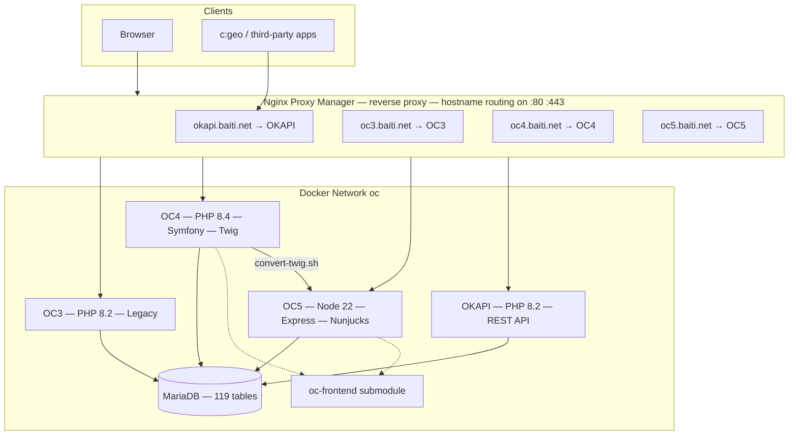
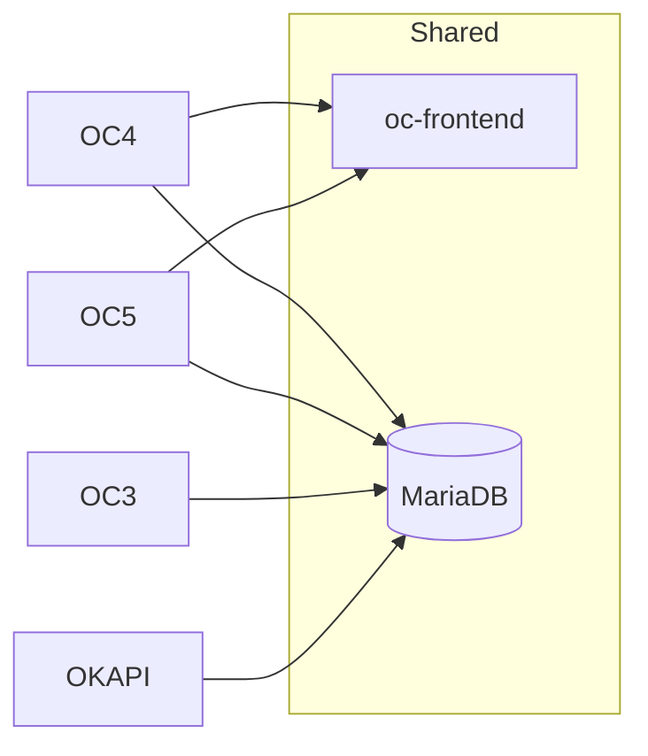
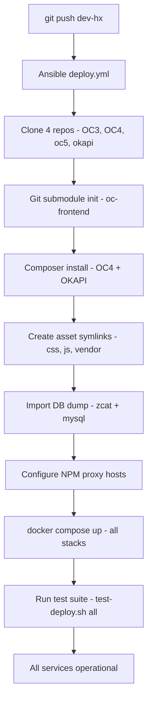

# OC Docker Stack — Architecture & Comparison

7 Docker stacks · 4 applications · 1 shared database · Deterministic deploy via Ansible playbook.

---

## 1. Infrastructure Overview



Seven Docker stacks: dockge, npm, mariadb, oc3, oc4, oc5, okapi.

**Two client paths:**
- **Browsers** → NPM (reverse proxy) → OC3 / OC4 / OC5 frontends
- **c:geo + third-party apps** → OKAPI REST API directly (JSON responses)

OKAPI is the public API surface — mobile apps, partner sites, and tools consume it.
The three frontends (OC3/OC4/OC5) serve HTML pages to browsers only.

NPM routes by Host header. All containers share a single Docker network and MariaDB.

---

## 2. OC4 — PHP / Symfony 7.x

| Component | Technology |
|-----------|-----------|
| Language | PHP 8.4 |
| Framework | Symfony 7.x |
| Web server | Apache + PHP-FPM |
| Database | Doctrine DBAL (raw SQL, no ORM) |
| Templates | **Twig** — canonical source |
| Dependencies | 24 direct, ~50 transitive (Composer) |
| Image | shinsenter/php:8.4-fpm-apache (344 MB) |
| Deploy steps | clone → submodule init → composer install → cache:clear → symlinks |

```
Request → Router → Controller → Repository(QueryBuilder) → Database
                ↓
              Auth (cookie + sys_sessions)
                ↓
              Twig template
                │
                └──[convert-twig.sh]──→ OC5 Nunjucks
```

OC4's Twig templates are the **canonical source** for all page markup.
After cleanup: 0 ORM entities, 0 ServiceEntityRepository, 0 security firewall.
Stripped from ~344K LOC to ~15K actual business logic.
Controllers inject plain PHP repositories that use Doctrine DBAL's `createQueryBuilder()`.

---

## 3. OC5 — Node.js / Express

| Component | Technology |
|-----------|-----------|
| Language | JavaScript (ES modules) |
| Framework | Express 5 |
| Web server | Express (built-in) |
| Database | MariaDB connector (raw parameterized SQL) |
| Templates | **Nunjucks** — derived from Twig |
| Dependencies | **8** (npm) |
| Image | node:22-alpine (**163 MB**) |
| Deploy steps | clone → submodule init → npm install |

```
Request → Express Router → pool.query(sql, params) → Database
                ↓
              Auth (cookie + sys_sessions)
                ↓
              Nunjucks template
```

Same architecture as OC4, half the size, half the steps, half the dependencies.
Templates are derived artifacts — OC4 Twig is converted to OC5 Nunjucks via `scripts/convert-twig.sh`.
All pages, API endpoints, and static assets share the same MariaDB schema as OC3/OC4/OKAPI.

### OC5 internals

```
oc5/
├── app.js                   # Express server, routes, i18n
├── public/
│   ├── _frontend/           # git submodule (oc-frontend)
│   ├── images/              # 392 files (copied from OC4)
│   ├── templates/nunjucks/  # 24 .njk files (derived from Twig)
│   └── translations/        # YAML files (copied from OC4)
├── src/
│   ├── db.js                # MariaDB connection pool
│   ├── auth.js              # Cookie → sys_sessions validation
│   ├── ocapi.js             # ~500 lines — all SQL queries
│   └── routes/              # 5 modules (caches, user, search, index, geocode)
└── package.json             # 8 deps
```

---

## 4. OC4 vs OC5 — Side by Side

| | OC4 | OC5 |
|---|-----|-----|
| Runtime deps | 24 + ~50 transitive | **8** |
| Image size | 344 MB | **163 MB** |
| Web server | Apache + PHP-FPM | **Express (built-in)** |
| Deploy steps | 5 | **3** |
| Cache step | Symfony container compile | **None** |
| DB access | Doctrine DBAL QueryBuilder | Raw parameterized SQL |
| Templates | Twig → canonical | Nunjucks ← derived |
| Frontend JS | Shared — oc-frontend submodule | Shared — oc-frontend submodule |
| Auth | Same cookie → sys_sessions | Same cookie → sys_sessions |
| Database | Same schema — 119 tables | Same schema — 119 tables |

---

## 5. Shared Between Stacks



- **oc-frontend submodule**: 27 ES modules, CSS, vendor libs (Leaflet, Tabulator, Bootstrap). Every JS fix benefits both OC4 and OC5 simultaneously.
- **MariaDB**: Single schema shared by all four applications. 119 tables, 123+ triggers and stored procedures.
- **Auth**: Cookie-based. The `ocdevelopmentdata` cookie (base64-encoded JSON) is validated against `sys_sessions`. Same mechanism in OC3, OC4, and OC5.
- **Translations**: YAML files. Copied from OC4 to OC5. Same format, same keys.

---

## 6. Template Pipeline


| Twig | Nunjucks |
|------|----------|
| `` | `` |
| `{{ parent() }}` | `{{ super() }}` |
| `{{ 'key' \| trans }}` | `{{ i18n['key'] or 'key' }}` |
| `{{ var \| json_encode \| raw }}` | `{{ var \| safe }}` |

All template changes MUST be made in OC4 Twig first. OC5 Nunjucks files are derived artifacts — never edit them directly.  
**Exception**: `base.njk` is hand-maintained because the OC4 Twig uses Symfony-specific constructs (`path()`, `app.request.locale`, `knp_menu_render`, `|date`) that the converter cannot handle.

---

## 7. Deploy Pipeline



Single command from bare Debian VM to fully running stack:
```bash
ansible-playbook -i inventory.ini deploy.yml \
  -e "db_dump_file=/path/to/dump.sql.gz" \
  -e "git_user_name=hxdimpf" \
  -e "git_user_email=hxdimpf@gmail.com"
```

Idempotent — can be re-run safely. The playbook is the source of truth; every runtime fix must be backported to it.

---

## 8. Scaling & Horizontal Operation

OC5 is stateless — session data lives in the cookie and MariaDB, not in memory.
Templates are read-only on disk. No sticky sessions, no shared state between instances.

```
            Browser
               │
         NPM (load balancer)
          ├── oc5-1:3000
          ├── oc5-2:3000
          ├── oc5-3:3000
          └── oc5-4:3000
               │
          MariaDB (single shared instance, handles connection pooling per container)
```

One command to scale: `docker compose --scale oc5=4 up -d`.  
NPM distributes requests across all instances. Any instance can handle any request.
Rollouts are gradual — scale up new instances, then scale down old ones.

| Scaling dimension | OC4 (PHP/Apache) | OC5 (Node.js/Express) |
|---|---|---|
| Concurrency model | One process per request (PHP-FPM pool) | Single event loop handles thousands of connections |
| Horizontal unit | 344 MB container (Apache + PHP + Symfony) | **163 MB** container (Node + 8 npm deps) |
| Startup time | Composer autoload + Symfony container compile | npm install + Node boot (seconds) |
| DB connections | Each PHP worker opens its own | One connection pool per container, reused across all requests |
| Zero-downtime deploy | Cache clear dance, Apache graceful reload | Scale up new, scale down old via Docker |
| Shared state | None (stateless) | None (stateless) — same cookie, same DB |
| Sticky sessions required? | No | No (session UUID validated against DB) |

**OC5 advantage**: half the memory per instance, faster startup, no PHP-FPM pool tuning,
no Symfony container compilation, no Apache config. The event loop handles concurrency
natively — a single Node process does the work of dozens of PHP-FPM workers. Horizontal
scaling is a one-liner with Docker Compose, and NPM already provides the load balancing.

The bottleneck remains MariaDB. Scaling OC5 horizontally increases concurrent DB
connections — the solution is connection pooling per container (already in `src/db.js`)
rather than per request. PHP has no equivalent without external tools.

---

## 9. Evolution — From Bare Metal to Docker Stacks

The original test system ran on bare metal with Ansible provisioning a single VM:

```
Bare metal Debian 13
├── Apache (one instance, two vhosts)
│   ├── oc3 → PHP 8.2 FPM pool (20 children)
│   └── oc4 → PHP 8.4 FPM pool (20 children)
├── MariaDB (native install)
├── Redis + Memcached + mod_evasive
├── 21 PHP extension packages via apt
├── Self-signed SSL with certbot dirs
├── Cron jobs + 8 post-install scripts
└── OKAPI vendored into OC3 repo
```

The current system replaced all of that with Docker:

```
Docker Engine (any OS: macOS, Windows, Linux)
├── NPM (reverse proxy, container)
├── OC3 (container)
├── OC4 (container)
├── OC5 (container)
├── OKAPI (container)
└── MariaDB (container)
```

| | Old (bare metal) | New (Docker stacks) |
|---|---|---|
| Apps | 2 (OC3 + OC4) | **4** (OC3 + OC4 + OC5 + OKAPI) |
| Isolation | Shared Apache/PHP between apps | Full per-app container isolation |
| PHP versions | Two FPM pools, same host | Per-container, zero conflict |
| Scaling | Tune FPM children, Apache config | `docker compose --scale` |
| Deploy time | ~15 min + 8 post-install scripts | **~5 min** (git clone + compose up) |
| Idempotent | Mostly | **Fully** (containers are restartable) |
| Reproducible | Depends on OS packages | **Fully** (Docker images are pinned) |
| Dev workflow | Edit → push → pull → restart FPM | **Edit live** (volume mount, save = instant) |
| Host contamination | 21 PHP packages, MariaDB, Redis, Memcached | **Zero** — only Docker |
| Cross-platform | Debian 13 only | Any OS with Docker |
| Config management | 12 Ansible template files | 7 compose files + env vars |
| Frontend JS | One copy in OC3 repo | Shared submodule (OC4 + OC5) |

**Key win**: a new developer clones four repos and runs one Ansible command.
`docker compose down` removes every trace. No PHP, no database, no Apache
installed on their machine. The same playbook works on macOS, Windows, and Linux.

---

## 10. Key Takeaways

- Two independent backends (PHP + Node.js) sharing one frontend codebase.
- **OC5 is half the size, half the dependencies, half the deploy steps.**
- OC5 scales horizontally with zero code changes — `docker compose --scale`.
- Shared oc-frontend submodule — every JS improvement benefits both stacks simultaneously.
- Template pipeline: OC4 Twig → mechanical conversion → OC5 Nunjucks. Never diverged.
- Deterministic deploy: one Ansible command from bare VM to running production.
- Runs on any OS — `git clone && docker compose up`, no host contamination.
- Incremental migration is feasible: NPM can route individual pages to either stack.

> The database is the asset. The rest is replaceable.
