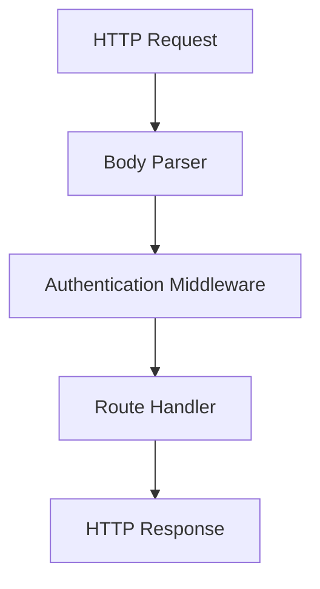

# Express Middleware for Symfony/PHP Developers

## The Key Idea

If you know Symfony, don't think of **middleware** as a new concept.

Think of it as a **request processing pipeline**. Every incoming request passes through a series of processing steps. Each step may:

- inspect the request
- modify the request
- reject the request
- generate a response
- pass the request to the next step

In Symfony this idea appears as kernel events, listeners and the security firewall. Express simply exposes these steps as ordinary JavaScript functions.

## Request Flow



Every box is simply a JavaScript function. Order matters — requests flow top to bottom.

Note: the body parser runs **before** auth. If auth needs to read POST data, `req.body` must already be available.

## Wiring the pipeline

```js
import express from "express";

const app = express();

// 1. Body parser — populates req.body BEFORE auth
app.use(express.urlencoded({ extended: true }));
app.use(express.json());

// 2. Auth — reads cookie, validates session, sets req.user
app.use(auth);

// 3. Routes — only reached if auth passed (or auth chose not to block)
app.get("/api/users", getUsers);
```

`app.use(fn)` runs for **every** request. `app.use('/api', fn)` only for paths starting with `/api`.

## Where `req.user` comes from

The auth middleware reads the session cookie, validates it against the database, and sets `req.user`. Anonymous users get `{ id: 0, username: null }`. Downstream handlers never see raw cookies — they get a user object.

This is the OC5 auth middleware (from `src/auth.js`):

```js
async function auth(req, res, next) {
  // Default: anonymous
  req.user = { id: 0, username: null, roles: [] };

  const raw = req.cookies?.oc5_session;
  if (!raw) return next();  // no cookie → stay anonymous → OK

  const data = JSON.parse(Buffer.from(raw, 'base64').toString());
  if (!data.userid || !data.sessionid) return next();

  // Validate session exists and user is active
  const [row] = await pool.query(
    `SELECT s.user_id FROM sys_sessions s
     JOIN user u ON s.user_id = u.user_id
     WHERE s.uuid = ? AND u.is_active_flag = 1`,
    [data.sessionid]
  );

  if (!row) return next();  // invalid session → stay anonymous

  // Load user
  const [user] = await pool.query('SELECT * FROM user WHERE user_id = ?', [data.userid]);
  if (user) {
    req.user = { id: user.user_id, username: user.username };
  }

  next();
}
```

The key: auth never blocks. It either sets `req.user.id = 0` (anonymous) or sets the real user. Route handlers check `req.user.id` themselves. This is a design choice — Symfony's firewall blocks by default. Express lets you choose.

## Route handler

```js
async function getUsers(req, res) {
    const users = await loadUsers();
    res.json(users);
}
```

No `next()` here. The response has been sent, so the pipeline ends.

## Error middleware

Symfony catches exceptions with event listeners. Express does it with **four-argument** middleware. The signature `(err, req, res, next)` tells Express this is an error handler:

```js
// Structured API error handler (from src/errors.js)
app.use((err, req, res, next) => {
  if (err.code && err.status) {
    return res.status(err.status).json({
      error: { code: err.code, message: err.message }
    });
  }
  next(err);  // not our error — pass to fallback
});

// Fallback for unexpected errors
app.use((err, req, res, next) => {
  console.error('Server error:', err.stack || err.message);
  res.status(500).render('error/500.njk');
});
```

Throw `err('LOG_PASSWORD')` anywhere, and the first handler catches it. Throw an unexpected SQL error, and the fallback renders a 500 page. Same pattern as Symfony's `kernel.exception` event — just spelled differently.

## The Factory Analogy

Imagine a package moving along a conveyor belt.


Each station either:

- processes the package and forwards it (`next()`)
- or stops the conveyor and returns a response.

That is all middleware is.

## Symfony ↔ Express

| Symfony | Express |
|----------|---------|
| `public/index.php` | `app.listen()` |
| Routing | `app.get()`, `app.post()` |
| `kernel.request` / Firewall | Middleware (`app.use()`) |
| `kernel.exception` | Error middleware (`err, req, res, next`) |
| Controller | Route handler |
| Request object | `req` |
| Response object | `res` |

## Take-away

There is nothing magical about middleware.

It is simply a chain of request-processing functions. Express makes that chain explicit, lightweight, and easy to compose. Symfony hides it behind events and listeners. Express puts it in front of you.
